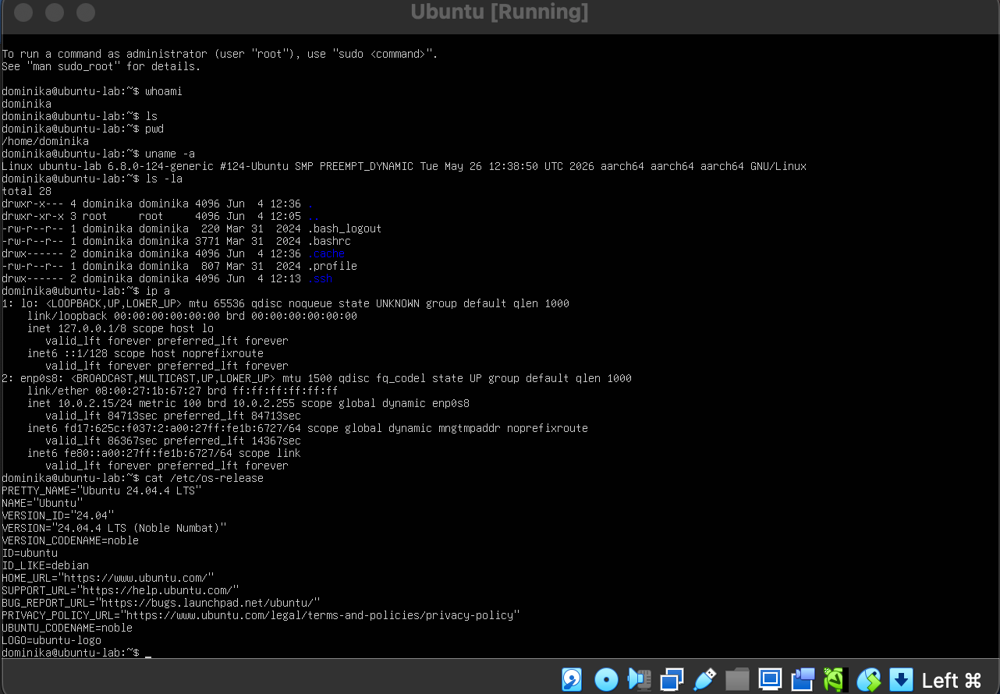
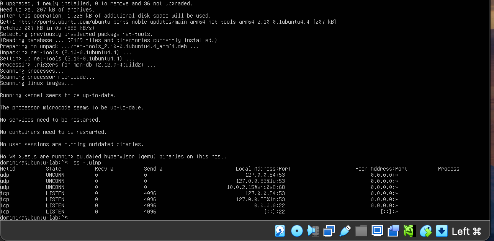

# Linux Home Lab — System Investigation Practice
### Personal Ubuntu VM — VirtualBox Home Lab

---

## What this lab was about

Set up a personal Ubuntu Linux 24.04 virtual machine 
using VirtualBox on macOS. Practiced real Linux 
investigation commands in my own environment — not 
just following guided labs but running commands 
independently on a self-configured system.

---

## Commands I practiced

| Command | What it does | SOC relevance |
|---|---|---|
| `whoami` | Shows current logged in user | Confirm which account you are investigating as |
| `pwd` | Shows current directory location | Know where you are in the file system |
| `uname -a` | Shows OS version and architecture | Identify the system during investigation |
| `ls -la` | Lists all files including hidden ones | Hidden files starting with . can indicate attacker activity |
| `ip a` | Shows network interfaces and IP addresses | Identify the machine on the network |
| `cat /etc/os-release` | Shows detailed OS information | Confirm system identity during forensic work |
| `ps aux` | Lists all running processes | Spot suspicious processes on a compromised machine |
| `last` | Shows login history | Who logged in, when, and from where |
| `ss -tulnp` | Shows open ports and listening services | Detect unexpected open ports that could indicate backdoors |

---

## What I found on my system

- Logged in as: dominika
- Hostname: ubuntu-lab
- OS: Ubuntu 24.04.4 LTS (Noble Numbat) — ARM64
- IP address: 10.0.2.15 (internal VirtualBox network)
- SSH service running on port 22 — expected since 
  OpenSSH was installed during setup
- No suspicious processes or unexpected open ports detected

---

## Key things I learned

- `ls` shows nothing if the directory is empty — 
  use `ls -la` to see hidden files too
- The `.ssh` folder in the home directory is where 
  SSH keys are stored — relevant for investigating 
  unauthorised access
- `ss -tulnp` is the modern replacement for `netstat` 
  on newer Ubuntu systems
- Private IP addresses like 10.0.2.x are internal 
  only and safe — not your real public IP
- Running `ps aux > processes.txt` saves long output 
  to a file for easier analysis

---

## Why this matters for SOC work

These are the exact commands a SOC analyst runs when 
investigating a potentially compromised Linux system. 
Understanding what normal looks like — normal processes, 
normal open ports, normal login history — is what makes 
abnormal activity stand out.

A suspicious finding would be:
- An unknown process running as root
- An unexpected port open like 4444 or 1337
- A login from an unusual IP at 3am

---

## Screenshots

### System Commands Output

### Open Ports — ss -tulnp Output  

---

## Environment

- Host: macOS (Apple Silicon M-series)
- VM Software: Oracle VirtualBox
- Guest OS: Ubuntu Server 24.04.4 LTS ARM64
- Purpose: Personal cybersecurity home lab

---

*Personal home lab practice — all activity performed 
on self-owned virtual machines only.*
