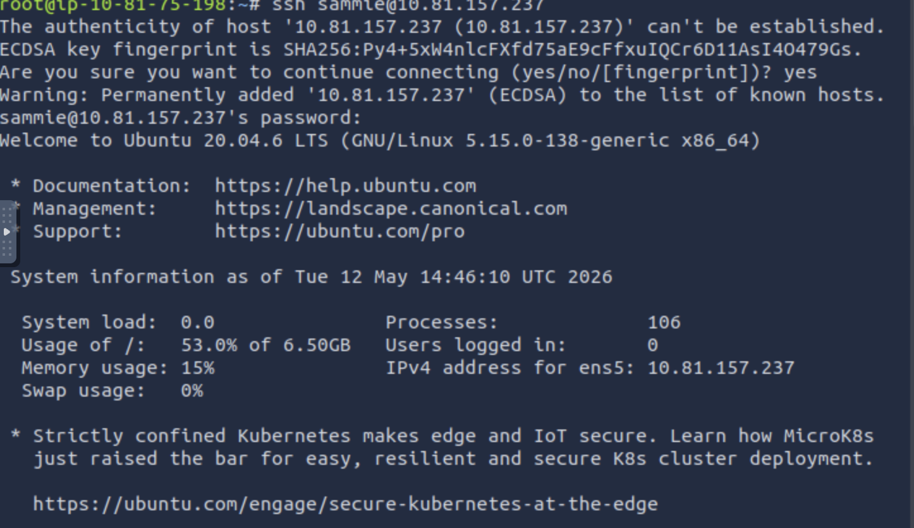

# SSH Authentication & Basic Linux Commands
### TryHackMe — Operating System Security Room

---

## What this room was about
This room showed how an attacker can get into a Linux system 
just by guessing a password — in this case one written on a 
sticky note in the office. Simple but surprisingly realistic.

We logged into a remote machine using SSH, poked around the 
file system, and looked at what other user accounts existed.

---

## Commands I actually used

| Command | What it does |
|---|---|
| `ssh sammie@10.81.157.237` | Log into a remote machine as a specific user |
| `whoami` | Confirms which user you're logged in as |
| `ls` | Lists files in the current folder |
| `cat FILENAME` | Shows the contents of a file |
| `history` | Shows what commands were previously run |
| `su - johnny` | Switch to a different user while already logged in |

---

## What I actually learned

- SSH doesn't show your password as you type — 
  that's normal, it's still registering it
- The first time you SSH into a server it warns you 
  about the host fingerprint — you type yes to continue
- Root on Linux = Administrator on Windows — 
  full unrestricted access to everything
- Weak passwords and physical security failures 
  like sticky notes are real attack vectors, 
  not just theoretical ones

---

## Why this matters for SOC work

Suspicious SSH logins are one of the most common things 
SOC analysts look for in logs — unusual times, 
unknown IPs, failed attempts followed by a success. 
Understanding how SSH works makes spotting those 
anomalies much easier.

---

## Screenshot

---

*Source: TryHackMe Pre-Security Path — Operating System Security*
